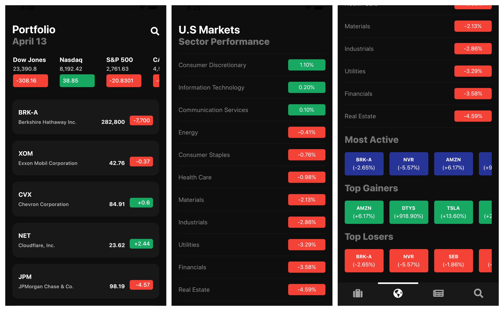
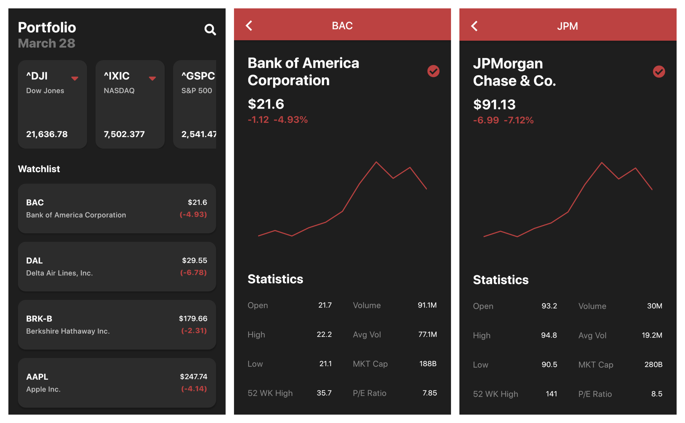
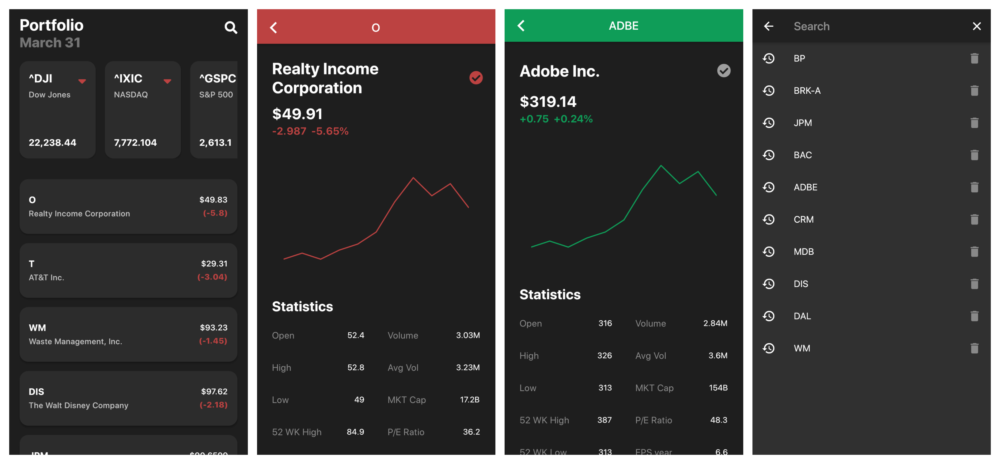
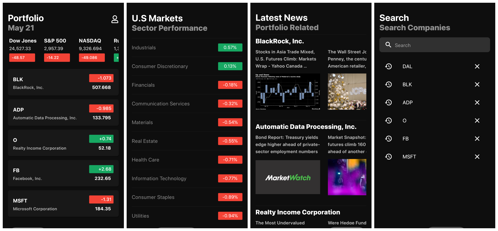
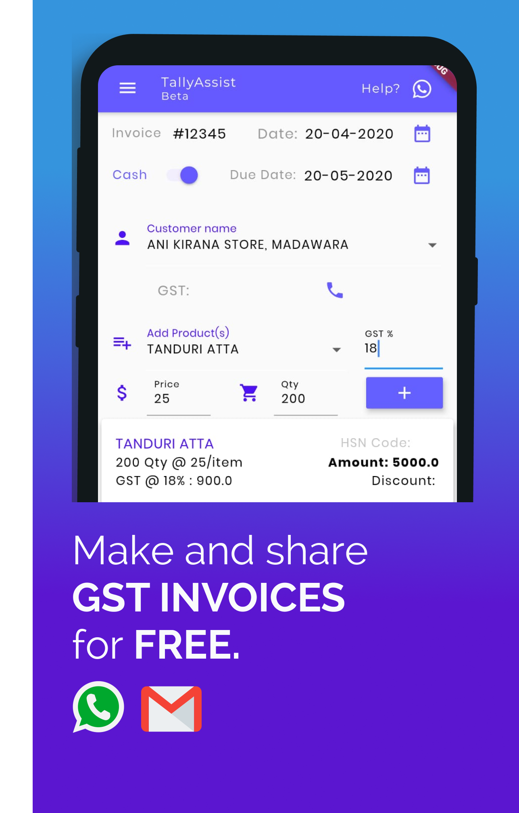
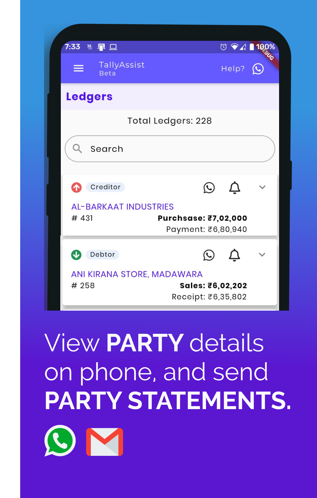
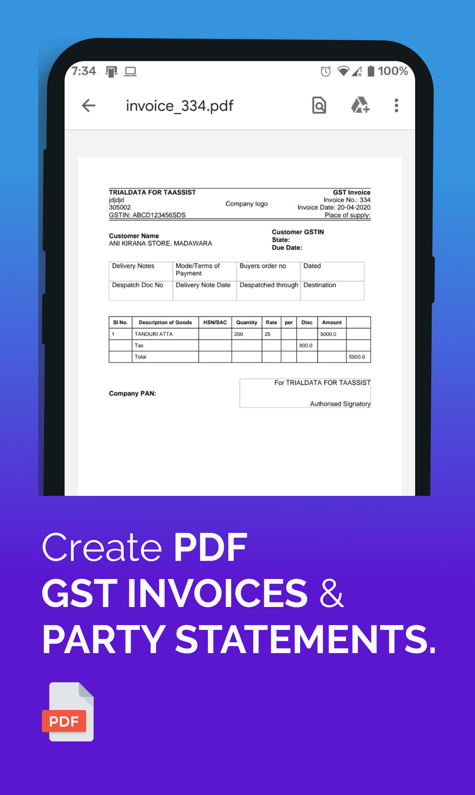
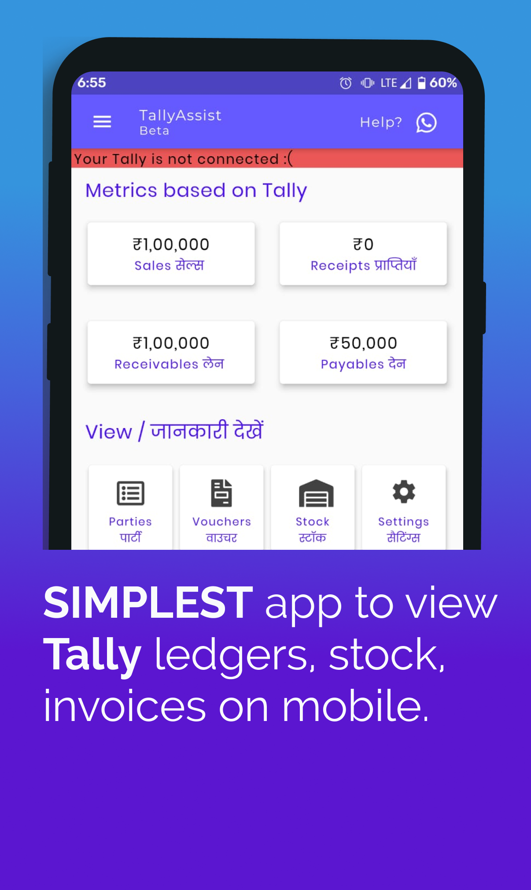
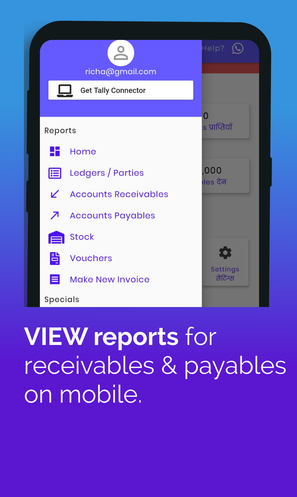
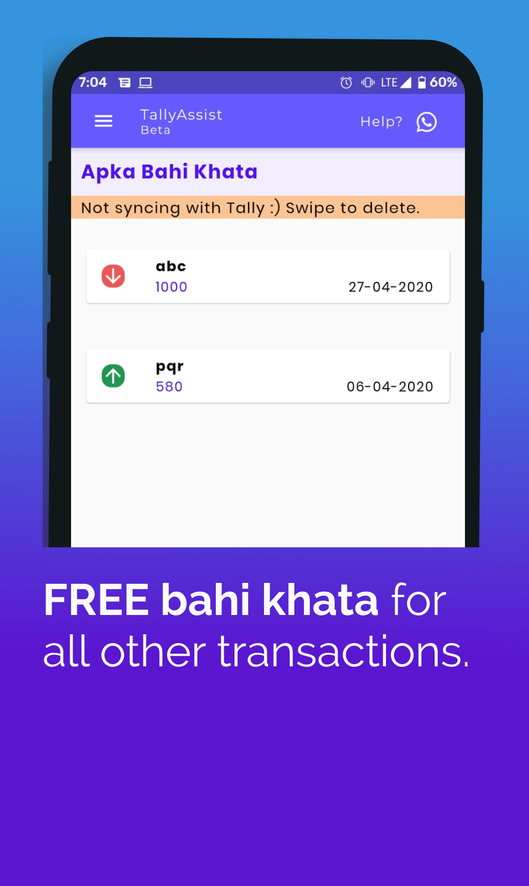

# Showcase of My Apps
## 1- STOCK MARKET APP IN FLUTTER
This is a simple app that helps users track their favorite stonks.

### Features
* Users can save stonks.
* Users can see stonks.
* Users can see market indexes.
* Users can search for stonks.
* Users can get detailed information about a single stonks.

  
   
  
  

## 2- BUSINESS ASSISTANT APP
### Features
* Invoice generator.
* Party (supplier/customer) statement generator.
* Invoice/voucher viewer.
* Business dashboard.
* Report screens for account payable, receivables, stock items.

  
   
  
  
  
  

## 3- TASK PLANNER UI IN FLUTTER
Task Planner App is built in flutter. App design is based on [Task Planner App](https://dribbble.com/shots/10951333/attachments/2566966?mode=media) designed by [Purrweb UI](https://dribbble.com/purrwebui).
This app is static. I mean, This is a UI design. No backend.
