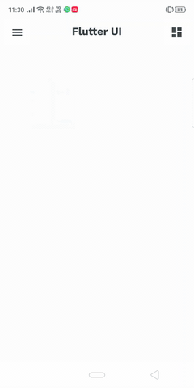

# Showcase of My Apps
## 1- Stock Market App in Flutter
This is a simple app that helps users track their favorite stonks.

### Features
* Users can save stonks.
* Users can see stonks.
* Users can see market indexes.
* Users can search for stonks.
* Users can get detailed information about a single stonks.

  
   
  
  

## 2- Business Assistant App
### Features
* Invoice generator.
* Party (supplier/customer) statement generator.
* Invoice/voucher viewer.
* Business dashboard.
* Report screens for account payable, receivables, stock items.

  
   
  
  
  
  

## 3- Task Planner UI in Flutter
Task Planner App is built in flutter. App design is based on [Task Planner App](https://dribbble.com/shots/10951333/attachments/2566966?mode=media) designed by [Purrweb UI](https://dribbble.com/purrwebui).
This app is static. I mean, This is a UI design. No backend.
## Screenshots

  HomePage              |   Calendar Page | Task Create Page
:-------------------------:|:-------------------------:|:---------------------:
||

## 4- Some Custom UI Designs in FLutter

  
   
  
  

## 5- E-Commerce Book Store
A complete Flutter E-Commerce Book Store application built using firebase as backend.

## Features 
 * Add or remove item in cart
 * Search products
 * Add Address
 * Payment through UPI
 * Firestore Backend
 * SignIn using firebase
